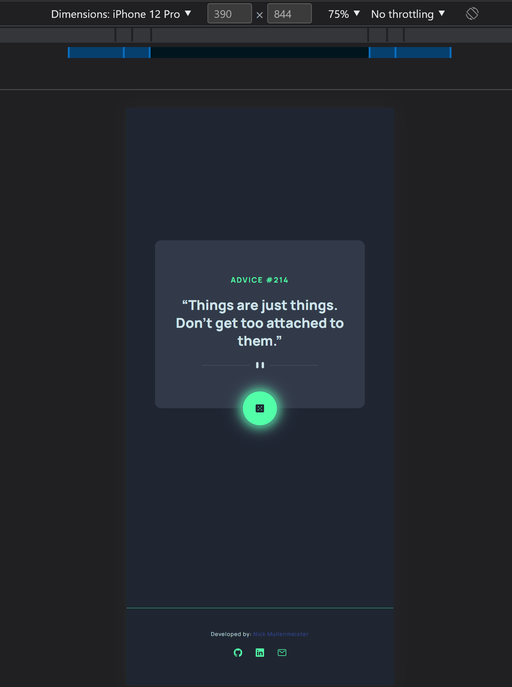

# Advice-Generator

A mobile-responsive app that allows users to get random pieces of advice with the click of a button.

## Link

Visit the website here: https://mully7773.github.io/Advice-Generator/

## Screenshots

 

 

## Description

This is my first Frontend Mentor challenge. You can find more information about this challenge [here](https://www.frontendmentor.io/challenges/advice-generator-app-QdUG-13db). My task was to make the application look and function as close to the original design as possible. I also added a loading spinner that appears just before the advice is loaded to simulate a more realistic user experience.

## Functionality

Users are able to generate a new piece of advice by clicking the green dice icon. They can also use the app on mobile devices. I used an API called the Advice Slip API to generate the advice. You can view this API here: https://api.adviceslip.com

## Technology

HTML
 
CSS
 
JavaScript
 
MVC architecture
 
Mobile responsiveness
 
Advice Slip API

## Questions:

Feel free to contact me at mully7773@gmail.com if you have any questions.  
You can view more of my projects at https://github.com/Mully7773.
